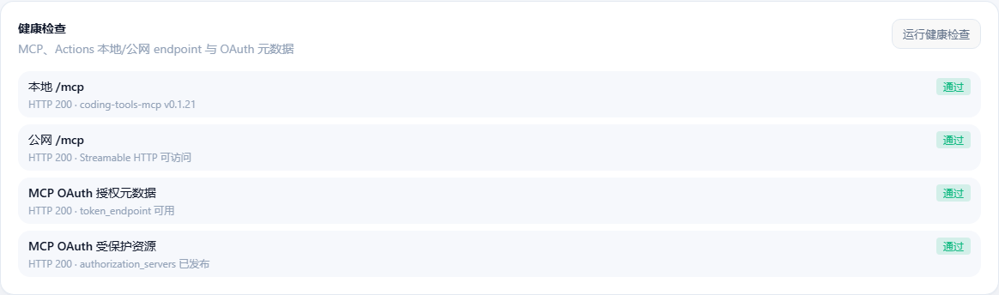
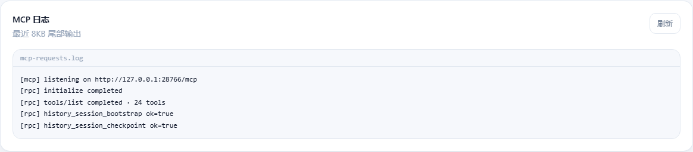

<p align="center">
  
</p>

<h1 align="center">Coding Tools MCP</h1>

<p align="center">
  Turn a local project into a persistent AI development workspace that carries context across conversations.
</p>

<p align="center">
  
  
  
  <a href="https://www.apache.org/licenses/LICENSE-2.0"></a>
</p>

<p align="center">
  <a href="README.md">繁體中文</a> · <a href="README.en.md">English</a> · Releases
</p>

Coding Tools MCP is a Rust + Tauri 2 desktop application. Select a project directory and start the service; an AI agent can then read files, edit code, run commands and tests, inspect Git, and preserve development progress inside the project through MCP. It behaves like an AI opening an IDE workspace that remembers where the last conversation stopped.


*One desktop app manages workspaces, MCP services, connection details, and the session-recovery prompt.*

## Understand the workflow in 30 seconds

```text
Install the desktop app
  → sidebar Quick setup (or add a workspace manually)
  → choose a tunnel source and finish connection
  → start MCP and copy the Public MCP URL
  → enable ChatGPT developer mode
  → create an MCP plugin and paste the URL
  → authorize it and start developing in a new conversation
```

For a first connection, remember only this: **the desktop app turns the project into an MCP workspace, and ChatGPT connects to it through the public `/mcp` URL.**

- [See the complete desktop setup](#get-started-in-five-minutes)
- [Quick setup wizard](#2-quick-setup-recommended-for-first-use)
- [Go directly to the ChatGPT plugin setup](#mcp-connector)

## Get started in five minutes

### 1. Install the desktop client

Download the package for your platform from this repository's Releases page:

| Platform | Package |
| --- | --- |
| Windows 10/11 x64 | `Coding.Tools.MCP_*_x64-setup.exe` |
| macOS Apple Silicon | `Coding Tools MCP_*_aarch64.dmg` |

The macOS build is currently unsigned. If macOS blocks the first launch, allow it from System Settings → Privacy & Security.

### 2. Quick setup (recommended for first use)

Open **Quick setup** in the sidebar (route `/quick-setup`) and follow the wizard. The flow matches the app implementation in five steps:

| Step | What you do |
| --- | --- |
| **1. Tunnel source** | Choose **Built-in WSS** (recommended), **FRP**, or **Cloudflare** |
| **2. Project** | Name the workspace (blank = first folder name), pick one or more project folders, create the workspace |
| **3. Connection type** | Choose **MCP** or **Actions** (the wizard enables one service at a time) |
| **4. Enable** | Fill source-specific fields, test the tunnel, start the service |
| **5. Finish** | See the exact values to paste into ChatGPT (public URL, auth fields) with copy helpers |

**What step 4 needs, by tunnel source:**

| Source | You provide | The wizard does |
| --- | --- | --- |
| **Built-in WSS** | A **one-time enrollment link** from your server admin (`https://…/_tunnel/enroll/<code>`, HTTPS required) | Validates the link, registers the local device key, updates the public URL |
| **FRP** | FRP server host/port and optional token | Checks/installs `frpc`; select or create a global FRP profile; MCP uses `/clients/<id>/mcp`, Actions needs its own subdomain |
| **Cloudflare Quick** | No token | Checks/installs `cloudflared`; a temporary `trycloudflare.com` URL is created during the connection test |
| **Cloudflare Named** | Tunnel token + fixed HTTPS public URL | Checks/installs `cloudflared`; saves token and fixed URL |

Afterwards you can open the normal workspace UI for advanced options (auth, policies, running MCP and Actions together). **Quick setup does not** create server-side enrollment links, an FRPS instance, or a Cloudflare Named Tunnel for you—those remain server/console tasks.

For self-hosted built-in WSS, see [3a. Built-in WSS](#3a-built-in-wss-self-hosted-server) and [`services/tunnel-server/README.md`](services/tunnel-server/README.md).

### 3. Add a workspace manually (advanced)

Without the wizard:

1. Click **Add workspace** in the sidebar.
2. Select the project root directory.
3. Configure the workspace name, MCP port, and authentication mode.
4. Save it. The workspace remains available in the sidebar across conversations and restarts.

### 4. Configure a public tunnel

When the AI client is not on the same machine, expose MCP as a publicly reachable HTTPS URL. Each workspace can use one of three tunnel types (**new workspaces default to built-in WSS**):

| Type | When to use | What you do in the desktop app |
| --- | --- | --- |
| **Built-in WSS (`builtin`)** | Self-host `coding-tools-tunnel-server`; terminate TLS with Caddy (or similar) | Paste the one-time enrollment link from the server |
| **FRP** | You already run FRPS | Save server/token under **FRP settings**; set a subdomain per workspace |
| **Cloudflare** | Cloudflare Tunnel | Install/detect `cloudflared`; set a token or use Quick Tunnel |

#### 3a. Built-in WSS (self-hosted server)

Architecture (matches the current implementation):

```text
ChatGPT / public HTTPS clients
        → Caddy (TLS)
        → coding-tools-tunnel-server (8088 public / optional 8089 Admin)
        → desktop embedded WSS client (protocol coding-tools-tunnel-v3)
        → local MCP or Actions
```

**Server (summary)**

1. Start with Docker Compose or the binary as described in [`services/tunnel-server/README.md`](services/tunnel-server/README.md) ([繁體中文](services/tunnel-server/README.md) / [English](services/tunnel-server/README.en.md)).
2. Set `CODING_TOOLS_TUNNEL_PUBLIC_ORIGIN` to your real HTTPS origin (enrollment links use it).
3. If Admin WebUI is enabled: supply username and password yourself (**the server never auto-generates the password**; at least 12 bytes).
4. Create a one-time enrollment link via Admin or CLI (for example `enroll create --client-id <id> --service both`).

Reverse-proxy these paths to port `8088` (ahead of any FRP fallback): `/_tunnel/v1`, `/_tunnel/enroll/*`, `/builtin/*`, and the matching `/.well-known/.../builtin/*` routes. Do **not** expose Admin (`8089`) on the public internet.

**Desktop**

1. Set the workspace tunnel type to **Built-in WSS tunnel**.
2. Paste the one-time enrollment link and save.
3. The app generates an Ed25519 keypair and device ID locally, stores the **private key** in the OS secret store, and registers only the **public key**. The server-assigned Client ID is authoritative; the public URL updates automatically.
4. MCP and Actions in the same workspace share one device identity. After revocation, paste a **new** enrollment link to rotate keys.

Public paths look like:

- MCP: `https://<your-domain>/builtin/clients/<client-id>/mcp`
- Actions: `https://<your-domain>/builtin/actions/<client-id>`

Local placeholders default to `http://127.0.0.1:8088/...` (same default origin as the server). Production should use your HTTPS reverse-proxied domain.

Full deploy steps, env vars, CLI, and troubleshooting: [tunnel-server README (zh-TW)](services/tunnel-server/README.md) / [English](services/tunnel-server/README.en.md). Design notes: [`docs/builtin-wss-tunnel.md`](docs/builtin-wss-tunnel.md).

#### 3b. FRP

- Install or detect `frpc` from **Software management**.
- Save the server, port, and token under **FRP settings**.
- Give each workspace a distinct subdomain. The app manages the FRP process and aggregates multiple proxy routes.


*FRP server profiles are stored centrally; each workspace only selects a profile and supplies its own subdomain.*

If you do not have an FRPS server yet, follow this [FRPS server installation guide (Chinese, WeChat)](https://mp.weixin.qq.com/s/kmpQhHsvmHlaLfj4rw3A0Q). After deployment, enter the server address, port, and token under **FRP settings** in the desktop client.

#### 3c. Cloudflare

- Install or detect `cloudflared` from **Software management**.
- Select Cloudflare in the workspace and configure a named-tunnel token or Quick Tunnel.

### 5. Start MCP

Open the workspace and click **Start** in the MCP panel. The desktop client shows:

- a local MCP URL such as `http://127.0.0.1:28766/mcp`;
- the public HTTPS MCP URL;
- authentication details for ChatGPT;
- live logs and health-check results.


The desktop app can verify the local and public endpoints, OAuth metadata, and the MCP protected-resource document:



*Each connectivity and authentication check reports its result separately.*

When a connection fails, inspect recent MCP requests without leaving the desktop app:



*The log quickly confirms whether tool discovery, history bootstrap, and checkpoint calls reached the server.*

### 6. Connect an AI client

Use the public MCP URL shown by the app. With OAuth enabled, the client follows the server metadata into the authorization flow; authorization codes, Client IDs, and secrets can be generated and managed from the desktop client. This release uses preconfigured OAuth clients, so select static/manual OAuth credentials when creating a ChatGPT plugin; CIMD is not required.

For a first connection, ask the agent to initialize history before inspecting the workspace:

```text
history_session_bootstrap
server_info
get_default_cwd
git_status
check_exec_environment
```

This gives the agent explicit project and capability state instead of guessing from the current chat window.

## Two ways to connect ChatGPT

| Mode | Best for | Use this endpoint |
| --- | --- | --- |
| MCP Connector | Direct access to files, commands, and Git | the workspace's public `/mcp` URL |
| GPT Actions | Importing OpenAPI tools into a custom GPT | the Actions panel's `/openapi.json` URL |

### MCP Connector

Before configuring ChatGPT, make sure that:

1. The workspace MCP service and public tunnel are both running.
2. The public MCP endpoint passes the desktop health check. If OAuth is enabled, also verify the protected-resource document and authorization metadata.
3. You have copied the **Public MCP URL** from the desktop **GPT configuration** card. For OAuth, also have the OAuth Client ID, OAuth Client Secret, and authorization password ready.

> ChatGPT must use the public HTTPS `/mcp` URL. A local address such as `http://127.0.0.1:28766/mcp` is not reachable from ChatGPT. Menu names may vary slightly by ChatGPT version and language.

#### 1. Enable ChatGPT developer mode

Open ChatGPT settings, go to **Account security and sign-in**, and enable **Developer mode**. This allows unverified MCP connectors to be added.


*Developer mode grants powerful access. Only connect MCP servers that you operate or explicitly trust.*

#### 2. Create the MCP plugin

Open **Plugins** from the ChatGPT sidebar, click the `+` button, select the MCP beta option, and enter:

| ChatGPT field | Value |
| --- | --- |
| Name | A recognizable name such as `Coding Tools MCP` |
| Description | A short description of the connected project or purpose |
| Connection | The public MCP URL from the desktop **GPT configuration** card; it should end in `/mcp` |
| Authentication | The same mode configured in the desktop app; the screenshot uses OAuth |


For OAuth, open the advanced OAuth settings, select static/manual OAuth credentials, and enter the Client ID and Client Secret shown by the desktop app. CIMD is not required. When ChatGPT opens the authorization page, enter the authorization password from the desktop **GPT configuration** card.

> Client Secrets, authorization passwords, and Bearer tokens are sensitive. Never paste them into chats, issues, or public screenshots. If the desktop app uses Bearer or no authentication, select the matching option currently offered by ChatGPT.

#### 3. Verify the connection

Start a new conversation with the plugin enabled and ask:

```text
Use Coding Tools MCP to call server_info, get_default_cwd, and git_status.
Tell me which workspace is connected, its default directory, and its Git status.
```

If ChatGPT returns information from the current project, the desktop app, public tunnel, authentication, ChatGPT, and MCP tool chain are connected end to end. Before real development, call `history_session_bootstrap` to initialize or restore project history.

If ChatGPT still shows an old tool list, disconnect and reconnect the plugin or verify again in a new conversation.

#### Troubleshooting

| Symptom | Check first |
| --- | --- |
| ChatGPT cannot connect | Confirm that the URL is the public HTTPS `/mcp` endpoint rather than `127.0.0.1`, and that the public MCP health check passes |
| OAuth authorization fails | Confirm that the Client ID, Client Secret, and authorization password come from the same workspace, and check the OAuth metadata results |
| New tools are missing | Disconnect and reconnect the plugin, then start a new conversation |
| A tool call fails | Open **Logs** and **Health checks** in the desktop app and confirm that the request reached the MCP service |

### GPT Actions

1. Start the workspace Actions service.
2. Copy the OpenAPI URL from the Actions panel.
3. Import the URL in the GPT editor's Actions page.
4. Select None, API Key, or OAuth to match the desktop configuration.

MCP and Actions can run together for the same workspace, with separate ports and subdomains when needed.

## Why use it

- **Built for real development**: files, commands, Git, tests, and retained processes live in one Workspace.
- **Cross-conversation continuity**: a new conversation can recover the complete history summary and the latest detailed handoff.
- **Auditable progress**: structured checkpoints preserve decisions, changed files, test results, remaining issues, and next steps inside the project.
- **Multiple workspaces**: one desktop client stores multiple projects and manages their MCP, Actions, and public endpoints.
- **Direct ChatGPT connectivity**: Streamable HTTP, OAuth, Bearer tokens, OpenAPI, plus built-in WSS, FRP, and Cloudflare tunnels.
- **A focused default tool surface**: stable core tools are available by default; advanced Harness capabilities are opt-in.

## Let the project remember every conversation

Chat transcripts are useful for rereading a discussion, but they are a poor long-term development handoff. Coding Tools MCP stores progress in `docs/history-session/` under the current project, so context follows the repository instead of staying trapped in one chat window.


*Paste the full prompt into a new conversation to initialize or restore history, then save a checkpoint after each completed task.*

Three tools work together:

| Tool | Purpose |
| --- | --- |
| `history_session_bootstrap` | Initialize or restore a project session; a new file embeds a compressed summary of prior sessions and returns a stable `session_key` and `current_path` |
| `history_session_checkpoint` | Save structured progress to the stable target returned by bootstrap; reject mismatched targets instead of writing to another history file |
| `history_session_validate` | Validate numbering, history files, and session mappings; rebuild derived indexes when needed without deleting existing history |

History uses readable Markdown that can be backed up or committed with the project. Every new file starts with a bounded inherited summary that is not recursively copied into later summaries. Checkpoints are idempotent, and progress should only be reported as saved after the tool returns `ok=true` with the same session target.

> History persistence is performed when the AI calls the MCP tools; the desktop app does not record chat content in the background. If the client does not invoke a tool, the server cannot infer that a new conversation or task has happened.

## What an agent can do

The default `core` profile provides a stable, composable development tool set:

| Category | Main tools |
| --- | --- |
| File reading | `read_file`, `list_dir`, `list_files`, `search_text`, `grep_text`, `view_image` |
| File modification | `apply_patch` |
| Command execution | `exec_command`, `write_stdin`, `read_output`, `kill_session` |
| Git | `git_status`, `git_diff`, `git_log`, `git_show`, `git_blame` |
| Environment | `server_info`, `check_exec_environment`, `get_default_cwd`, `set_default_cwd` |
| History sessions | `history_session_bootstrap`, `history_session_checkpoint`, `history_session_validate` |

A typical development loop is:

```text
Open Workspace
  → understand project and Git state
  → search and read code
  → apply a transactional patch
  → run commands and tests
  → inspect the diff and commit
```

The advanced profile retains project-state and operation-history Harness capabilities, but normal edits and command execution do not require a Task.

## Permission and recovery model

The project uses a Workspace-first permission model:

- Normal files inside the Workspace can be read, created, modified, deleted, and executed.
- Outside the Workspace, `read_file`, `list_dir`, `list_files`, `search_text`, and `view_image` provide read-only access.
- Writes, deletes, and command execution outside the Workspace are blocked.
- `.git` and `.github` cannot be damaged through ordinary file tools, Patch, or interpreter commands.
- Patch performs preflight validation and operation-local recovery; long-term recovery uses Git instead of full Workspace snapshots.

> Windows child-process execution currently uses a `policy_only` boundary. The honest runtime value is `sandbox_enforced: false`; static command policy is not a complete OS filesystem sandbox.

## Local development

Requirements: Node.js 20+, Rust stable, and the [Tauri 2 prerequisites](https://v2.tauri.app/start/prerequisites/) for your platform.

```bash
npm install
npm run desktop
```

Useful verification commands:

```bash
npm run check
npm run build
cd src-tauri && cargo test
cd src-tauri && cargo clippy --all-targets -- -D warnings
```

On Windows, you can also run `dev-desktop.cmd`. Do not use `npm run dev` alone to validate the desktop application; it starts Vite without the Tauri shell.

## Project layout

| Path | Purpose |
| --- | --- |
| `src-tauri/src/tools/` | Shared file, Patch, Exec, and Git tool kernel |
| `src-tauri/src/mcp/` | MCP Streamable HTTP server |
| `src-tauri/src/actions/` | ChatGPT Actions OpenAPI gateway |
| `src-tauri/src/tunnel/` | Built-in WSS, FRP, and Cloudflare tunnels and process management |
| `services/tunnel-server/` | Self-hosted built-in WSS tunnel server (Rust) |
| `src/` | SvelteKit desktop UI |
| `old/` | Python reference implementation and compatibility baseline |

## Source repository and attribution

This project is a derivative of the upstream Coding Tools MCP work and preserves its copyright and license notices (see [NOTICE](NOTICE)):

- [xyTom/coding-tools-mcp](https://github.com/xyTom/coding-tools-mcp)
- [mybolide/coding-tools-mcp](https://github.com/mybolide/coding-tools-mcp)

## Acknowledgments

Thanks to the [Linux.do](https://linux.do/) community for project promotion and feedback.

## License

This project is licensed under the [Apache License 2.0](https://www.apache.org/licenses/LICENSE-2.0).

- Full license text: [LICENSE](LICENSE)
- Attribution / NOTICE: [NOTICE](NOTICE)

If you use code, documentation, substantial implementation details, or derivative work from this project, preserve the copyright notice, license notice, and `NOTICE` file, and clearly attribute the original project.
